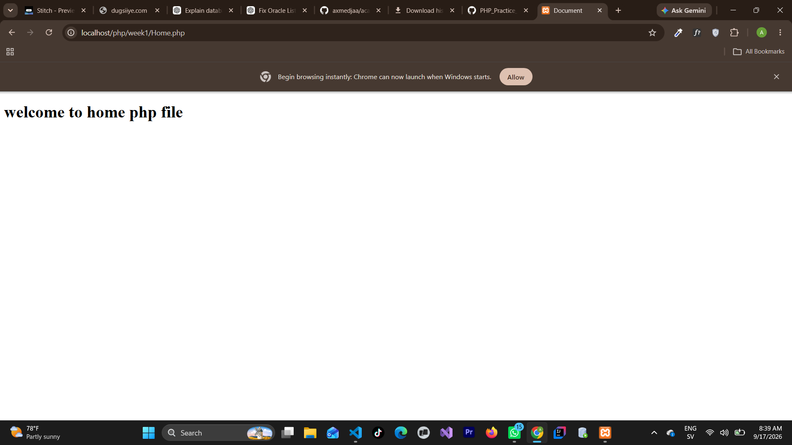
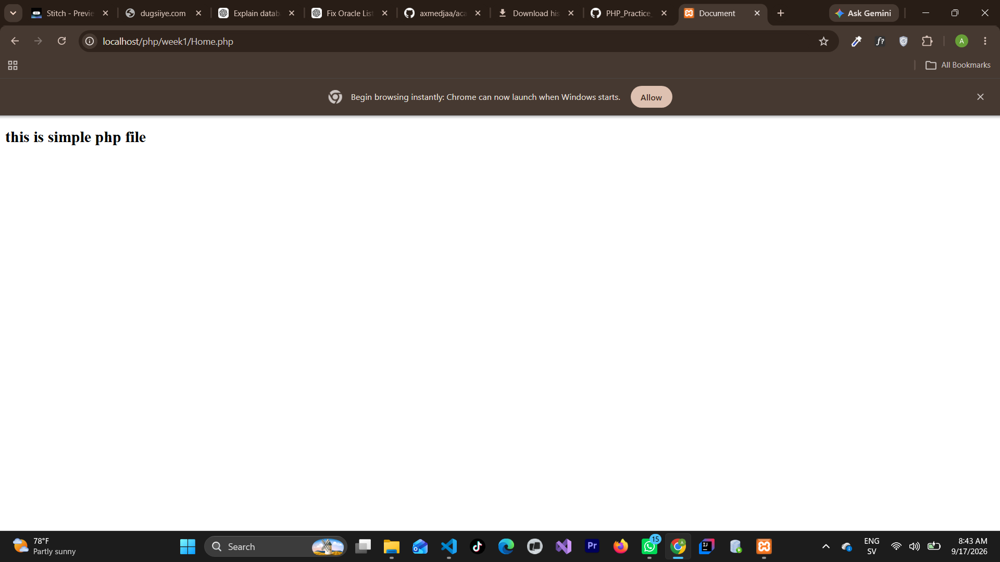

# 1. Heading Output with `echo`

## Screenshot Name

`echo.png`

## Description

This screenshot demonstrates displaying HTML heading elements (`<h1>`) using the `echo` statement in PHP.

Main concepts covered:

- The `echo` construct outputs text or HTML elements directly to the web browser.
- HTML tags embedded inside string literals are processed by the server and rendered as structured elements by the browser.

Example Code:

```php
<?php
echo "<h1>welcome to home php file</h1>";
?>
```

## Screenshot



---

# 2. Subheading Output with `print`

## Screenshot Name

`print.png`

## Description

This screenshot demonstrates rendering HTML subheadings (`<h2>`) and line break elements using the `print` statement.

Main concepts covered:

- `print` functions similarly to `echo` for outputting content to the browser.
- HTML elements such as `<h2>` and `<br>` are parsed seamlessly when outputted through `print`.

Example Code:

```php
<?php
print "<h2>this is simple php file</h2><br>";
?>
```

## Screenshot



---

# 3. Outputting Multiple Arguments with `echo`

## Screenshot Name

`multiitem-echo.png`

## Description

This screenshot demonstrates passing multiple comma-separated string parameters inside a single `echo` statement.

Main concepts covered:

- `echo` accepts multiple comma-separated arguments for output without string concatenation operators.
- Unlike `echo`, `print` accepts only a single argument; passing multiple parameters to `print` causes a syntax error.

Example Code:

```php
<?php
echo "yahye", "ahmed <br>";
?>
```

## Screenshot


---

# 4. Variable Interpolation in Output

## Screenshot Name

`variable.png`

## Description

This screenshot illustrates variable declaration and inline variable evaluation (interpolation) inside double-quoted strings.

Main concepts covered:

- Variables in PHP start with a dollar sign (`$a = 10;`).
- Variable names enclosed within double quotes (`"..."`) are dynamically parsed and evaluated to their stored values before printing.

Example Code:

```php
<?php
$a = 10;
print "hellow $a";
?>
```

## Screenshot


---

# 5. String Length Function (`strlen`)

## Screenshot Name

`strlen.png`

## Description

This screenshot demonstrates calculating and displaying the total character count of a string variable using PHP's built-in `strlen()` function.

Main concepts covered:

- `strlen()` returns the exact length of a string, including letters, numbers, spaces, and special characters.
- For the test string `'welocme to php republic'`, the resulting output is `23`.

Example Code:

```php
<?php
$my_str = 'welocme to php republic';
echo strlen($my_str);
?>
```

## Screenshot


---

# 6. String Word Count Function (`str_word_count`)

## Screenshot Name

`word-count.png`

## Description

This screenshot demonstrates counting the total number of words inside a string using the `str_word_count()` function.

Main concepts covered:

- `str_word_count()` analyzes a string and returns the count of words contained within it.
- For the test string `'welocme to php republic'`, the resulting output is `4`.

Example Code:

```php
<?php
$my_str = 'welocme to php republic';
echo str_word_count($my_str);
?>
```

## Screenshot


